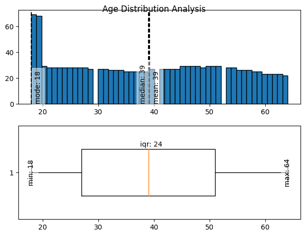
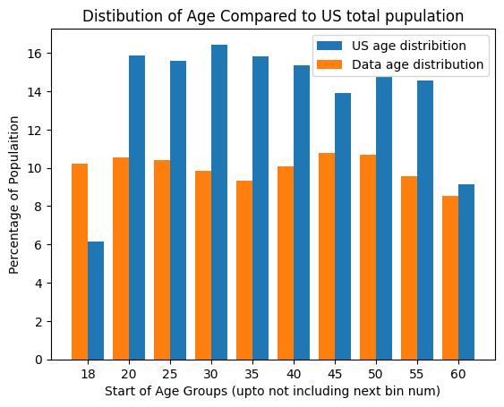
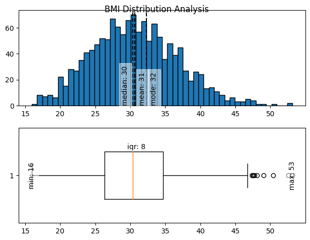
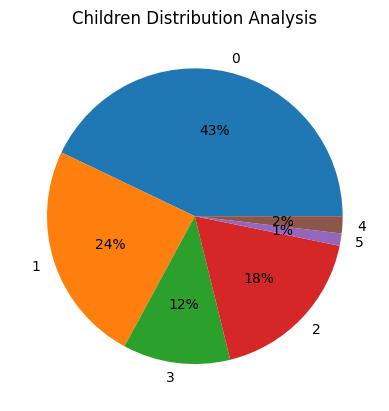
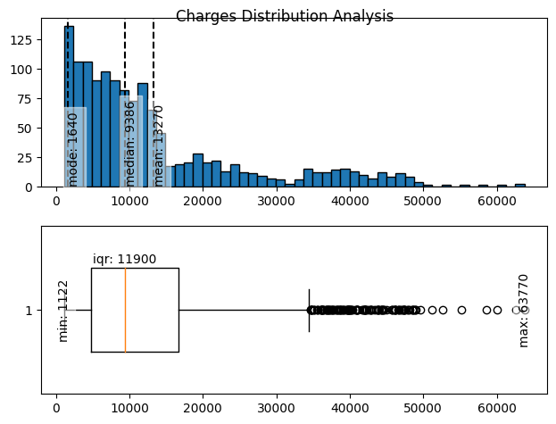
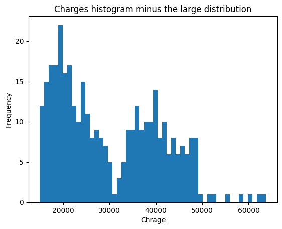
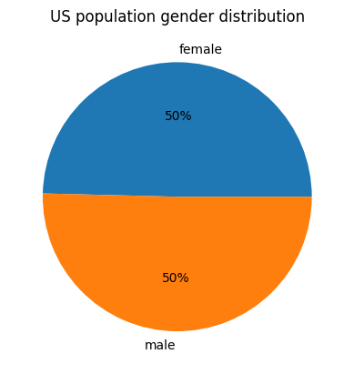
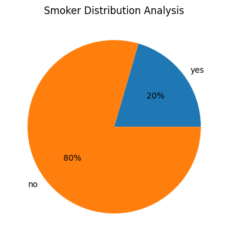
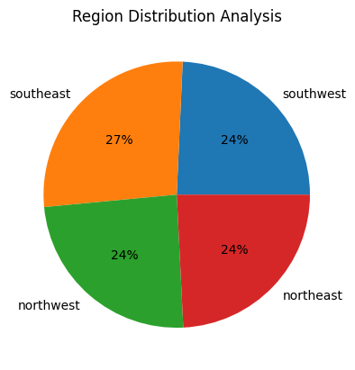

# U.S. Medical Insurance Costs
(This is a work in progress, it will be improved as I learn more)

# 1. Overview

This project aims to showcase some investgative skills learnt so far (45% complete) through the Data Science Career Path on Codecademy. It will involve a CSV file which I will analyze to come up with some findings and potitnital use cases for this dataset. (This is a work in progress so may be improved over time with more experience) 

## 1.1 Contents

1. Overview  
&ensp;1.1 Contents  
&ensp;1.2 Observing the Data  
&ensp;1.3 Goals
2. Descriptive Analysis  
&ensp;2.1 Helper Funcitons  
&ensp;2.2 Describing the Variables  
&ensp;&ensp;&ensp;2.2.1 Age  
&ensp;&ensp;&ensp;2.2.2 BMI  
&ensp;&ensp;&ensp;2.2.3 Children  
&ensp;&ensp;&ensp;2.2.4 Charges  

## 1.2 Observing the Data
From observing the data set, it is structured as follows:
|Name|Type|
|:---|:---|
|age|numerical (int)|
|sex|categorical (male/female)|
|bmi|numerical (float)|
|children|numerical (int)|
|smoker|categorical (yes/no)|
|region|categorical|
|charges|numerical (float)|

There doesn't seem to be any missing data.

## 1.3 Goals
- [X] Descriptive Analysis, (mean, mode, range, count, of each variable)
- [ ] Exploratory Analysis, do some investication into correlations between columns

# 2 Descriptive Analysis

I will first do some descriptive analysis to understand the dataset better. Will inlude varius displays of values and charts.

numerical:

- mean - center of the distribution
- standard deviation - sread of the distribution (lower the less variability)
- skewness 
-
- mode - peak of the distribution
-
- median - middle value of data, robust
- interquartile range - robust
-
- range
- variance

categorical:

- frequency - the count
- proprtion - frequency/total
- percentage - proportion converted

## 2.2 Describing the variables

### 2.2.1 Age

- [ ] somethings happening at 18

- [ ] nothing after 64 or before 18

- [ ] even spread apart form 18

the top two graphs show that the spread of the data is quite even across the age groups, with a spike at age 18. understanding if this is a good sample of ages needs investigation to find if this has a similar spread to the spread of the ages of total population of the US.

Comparing the spread of the ages in our data with the general population ([as of 2022](https://data.census.gov/table/ACSST1Y2022.S0101?q=population%20by%20age)), we can see that this spike at 18-20 is not aligned with the general population trends. the data also seems to have more over 60 data points compared to the proportions within the general population. The US age distribution dataset includes the total population, not just those with medical insurane. this dataset may not be proportionally representitive of all age groups. 

### BMI

These plots show that within this dataset, the average bmi is 31. For adults 20 years or older, the bmi chart is as follows:
|BMI|Weight Status|
|:---|:---|
|Below 18.5|Underweight|
|18.5 – 24.9|Healthy Weight|
|25.0 – 29.9|Overweight|
|30.0 and Above|Obesity|

The data that we have does include ages below 20, but a general observation is that the trend in this dataset is that, with a median of 30, over half of the observations are included in the "Obecity" weight status. with the majority of poeple between 25 and 35, which is another observation showing the above healthy weight trend.

there are also a few outliers on the high end that are VERY HIGH

### Children

This chart shows that most people in this data set have no children, the average number of children for this dataset is 1.1. in 2020, the fertility rate (number of childen born per woman) is [1.64](https://en.wikipedia.org/wiki/Demographics_of_the_United_States#Vital_statistics:~:text=1.93-,1.64,-Life%20expectancy%20at).

### Charges

this is an interesting graph, there is a strong scew to the right depicting that most poeple pay less than ~10,000. there are also 3 modes, one very stron one at the low end, one around ~20,000, and a third one ~40,000, with a few very high outliers above $60,000.

Thes multiple modes could be cause from other variables in the data. investication is needed to see if these smaller distibutions can be mapped via other variables.

Removeing the large distribution form the data shows to more very clear distributions that will need to be investigated for corelation.

### Sex 

this shows a very even split between males and females within this dataset.

comparing these two plots the male/female split in this dataset is aligned with the total us population data

### Smoker

there is a majority of non smokers within this dataset. this is one variable that should be tested to see corellations against the charges variable.

### Region

this shows a very even split over the regions apart from a slight increase in the south east region

## Questions

### Questions to ask about data collection
- Why is there a spike of people of ages 19-20?
- why are there no data points ager age 64?
- Why is there slightly more data points in the south east reagion? 

### Trends to analyse  
i will analyse the charges variable first as this is an important vaiable about Health Insurance. 
- age -> charges
- sex -> charges
- bmi -> charges
- children -> charges
- smoker -> charges  

From here i will see if there are any strong correlations and correlate those variables with others to see if that shows any other interesting features. 
